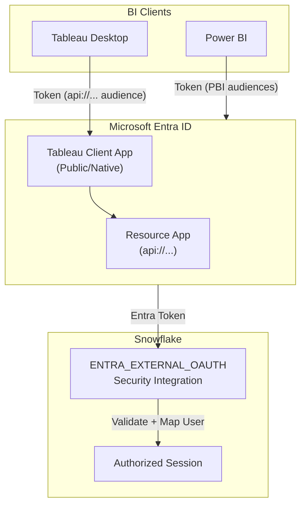

# Unified Entra External OAuth for Power BI & Tableau

<span class="security-badge security-best-practice">Best Practice</span>

This guide documents a **single, unified Microsoft Entra ID (Azure AD) External OAuth integration** that supports both Power BI and Tableau connecting to Snowflake.

!!! success "What You'll Build"
    Microsoft Entra ID becomes the OAuth authorization server, and Snowflake trusts Entra via **one** `TYPE=EXTERNAL_OAUTH` security integration. Both Power BI and Tableau Desktop obtain Entra tokens, and Snowflake validates them.

---

## Architecture Overview



---

## Component Requirements

### Shared Components (Both Power BI & Tableau)

| Component | Description | Required For |
|-----------|-------------|--------------|
| **Entra Resource App** | Application ID URI (`api://...`) + scope (`session:role-any`) | Both |
| **Snowflake Security Integration** | `TYPE=EXTERNAL_OAUTH` pointing to Entra issuer + JWKS keys | Both |
| **User Mapping** | Entra token claim (`upn`) → Snowflake user attribute (`LOGIN_NAME`) | Both |

### Tableau-Specific

| Component | Description |
|-----------|-------------|
| **Tableau OAuth XML** | Config file in `OAuthConfigs` folder defining IdP, scopes, and redirects |
| **Entra Client App** | Public/native app with localhost redirect URIs for desktop callback |

### Power BI-Specific

| Component | Description |
|-----------|-------------|
| **Power BI Audiences** | Must be included in `EXTERNAL_OAUTH_AUDIENCE_LIST` |
| **Network Policy** | Optional: Snowflake network policy for Power BI Service IP ranges |

---

## 1. Entra ID Setup

### 1.1 Resource / API App (Shared)

Register a **"Snowflake OAuth Resource"** app in Entra:

1. Go to **Azure Portal** → **Microsoft Entra ID** → **App registrations**
2. Click **New registration**
3. Configure:
    - **Name**: `Snowflake OAuth Resource`
    - **Supported account types**: Single tenant
    - **Redirect URI**: Not required for resource app

4. **Expose an API**:
    - Click **Expose an API** in the left menu
    - Set **Application ID URI**: `api://<application-id>` (e.g., `api://xxxxxxxx-xxxx-xxxx-xxxx-xxxxxxxxxxxx`)
    - Click **Add a scope**

5. **Add Scope** with these values:

| Field | Value |
|-------|-------|
| **Scope name** | `session:role-any` |
| **Who can consent** | Admins only |
| **Admin consent display name** | Snowflake role-any |
| **Admin consent description** | Allows connecting to Snowflake with role-any |
| **State** | Enabled |

!!! info "Scope Naming Convention"
    Snowflake explicitly documents role scopes with the `session:` prefix when using External OAuth with Entra.

---

### 1.2 Client App for Tableau Desktop (Tableau-Specific)

Create a **Public client / native app** registration:

1. **New registration**:
    - **Name**: `Tableau Desktop - Snowflake`
    - **Supported account types**: Single tenant
    - **Redirect URI**: Add under **Mobile and desktop applications**

2. **Add Redirect URIs** (Tableau Desktop uses localhost callbacks):

```
http://localhost:55556/Callback
http://localhost:55557/Callback
http://localhost:55558/Callback
http://localhost:55559/Callback
http://localhost:55560/Callback
```

3. **API Permissions**:
    - Click **Add a permission** → **My APIs**
    - Select your **Snowflake OAuth Resource** app
    - Choose **Delegated permissions** → Select `session:role-any`
    - Click **Grant admin consent** (recommended to avoid user prompts)

4. **Authentication Settings**:
    - Ensure **Allow public client flows** is set to **Yes**

---

### 1.3 Power BI Configuration (Power BI-Specific)

Power BI itself is the OAuth client — you typically **do not register a custom app** for the standard Power BI Snowflake connector.

Instead, Snowflake must trust the Power BI connector audiences in the security integration.

!!! note "No Custom App Required"
    Microsoft's Power BI Snowflake connector handles authentication automatically. Your Snowflake integration just needs to include the Power BI audiences.

---

## 2. Snowflake Setup

### 2.1 Important Constraint: One Issuer Per Account

!!! warning "Single Issuer Limitation"
    Snowflake does **not** allow two `EXTERNAL_OAUTH` integrations with the same `EXTERNAL_OAUTH_ISSUER`. This is why you need **one shared integration** with all audiences combined.

### 2.2 Combined Security Integration (Power BI + Tableau)

Create a single integration that supports both tools:

```sql
-- Description: Create ONE Entra External OAuth integration that supports both Power BI and Tableau.
-- - Power BI needs the two Power BI connector audiences.
-- - Tableau needs the api://<resource-app> audience (Application ID URI).
-- - role-any requires EXTERNAL_OAUTH_ANY_ROLE_MODE = ENABLE.
-- - Allowed roles list controls which roles may be used at session creation.

CREATE OR REPLACE SECURITY INTEGRATION ENTRA_EXTERNAL_OAUTH
  TYPE = EXTERNAL_OAUTH
  ENABLED = TRUE
  EXTERNAL_OAUTH_TYPE = AZURE
  EXTERNAL_OAUTH_ISSUER = 'https://sts.windows.net/<Your_Tenant_ID>/'
  EXTERNAL_OAUTH_JWS_KEYS_URL = 'https://login.microsoftonline.com/common/discovery/keys'
  EXTERNAL_OAUTH_AUDIENCE_LIST = (
    -- Power BI audiences (required for Power BI)
    'https://analysis.windows.net/powerbi/connector/Snowflake',
    'https://analysis.windows.net/powerbi/connector/snowflake',
    -- Tableau audience (your Entra Resource App ID URI)
    'api://<Your_Application_ID>'
  )
  EXTERNAL_OAUTH_TOKEN_USER_MAPPING_CLAIM = 'upn'
  EXTERNAL_OAUTH_SNOWFLAKE_USER_MAPPING_ATTRIBUTE = 'LOGIN_NAME'
  EXTERNAL_OAUTH_ANY_ROLE_MODE = 'ENABLE'
  EXTERNAL_OAUTH_ALLOWED_ROLES_LIST = ('PUBLIC', 'ACCOUNTADMIN')
  COMMENT = 'Shared Entra External OAuth integration for Power BI + Tableau Desktop (role-any).';
```

!!! tip "Replace Placeholders"
    - `<Your_Tenant_ID>`: Your Azure AD tenant ID (e.g., `xxxxxxxx-xxxx-xxxx-xxxx-xxxxxxxxxxxx`)
    - `<Your_Application_ID>`: Your Entra Resource App's Application ID

### 2.3 Field Reference

| Field | Purpose |
|-------|---------|
| `EXTERNAL_OAUTH_ISSUER` | Entra token issuer URL for validation |
| `EXTERNAL_OAUTH_JWS_KEYS_URL` | Public keys for token signature verification |
| `EXTERNAL_OAUTH_AUDIENCE_LIST` | All audiences this integration accepts |
| `EXTERNAL_OAUTH_TOKEN_USER_MAPPING_CLAIM` | Token claim for user identity (`upn`) |
| `EXTERNAL_OAUTH_SNOWFLAKE_USER_MAPPING_ATTRIBUTE` | Snowflake user attribute to match (`LOGIN_NAME`) |
| `EXTERNAL_OAUTH_ANY_ROLE_MODE` | Enable `role-any` behavior |
| `EXTERNAL_OAUTH_ALLOWED_ROLES_LIST` | Roles allowed at session creation |

### 2.4 Modify Existing Integration

If you already have the integration, use `ALTER`:

```sql
ALTER SECURITY INTEGRATION ENTRA_EXTERNAL_OAUTH
  SET EXTERNAL_OAUTH_AUDIENCE_LIST = (
    'https://analysis.windows.net/powerbi/connector/Snowflake',
    'https://analysis.windows.net/powerbi/connector/snowflake',
    'api://<Your_Application_ID>'
  );

ALTER SECURITY INTEGRATION ENTRA_EXTERNAL_OAUTH
  SET EXTERNAL_OAUTH_ALLOWED_ROLES_LIST = ('PUBLIC', 'ACCOUNTADMIN', 'ANALYST_ROLE');
```

---

## 3. Tableau Desktop Configuration

### 3.1 OAuth XML Configuration

Create an XML file that tells Tableau Desktop which IdP, scopes, and redirects to use:

```xml
<?xml version="1.0" encoding="UTF-8"?>
<OAuthConfig>
  <OAuthConfigId>custom_snowflake_entra_oauth</OAuthConfigId>
  <clientIdDesktop><Your_Tableau_Client_App_ID></clientIdDesktop>
  <clientSecretDesktop></clientSecretDesktop>
  <redirectUrisDesktop>
    http://localhost:55556/Callback,
    http://localhost:55557/Callback,
    http://localhost:55558/Callback,
    http://localhost:55559/Callback,
    http://localhost:55560/Callback
  </redirectUrisDesktop>
  <authUri>https://login.microsoftonline.com/<Your_Tenant_ID>/oauth2/v2.0/authorize</authUri>
  <tokenUri>https://login.microsoftonline.com/<Your_Tenant_ID>/oauth2/v2.0/token</tokenUri>
  <scopes>api://<Your_Application_ID>/session:role-any openid profile</scopes>
  <accessTokenResponseParamName>access_token</accessTokenResponseParamName>
  <refreshTokenResponseParamName>refresh_token</refreshTokenResponseParamName>
  <instanceUrlSignInEnabled>false</instanceUrlSignInEnabled>
  <dbclassOverride>snowflake</dbclassOverride>
  <userNameAttribute>id_token:upn</userNameAttribute>
</OAuthConfig>
```

!!! note "Public Client Configuration"
    For public/native clients with PKCE, the `clientSecretDesktop` is typically empty. Keep it blank if your Entra app is configured as a public client (recommended).

### 3.2 File Location

Place the XML file in the Tableau Repository `OAuthConfigs` folder:

=== "macOS"

    ```
    ~/Documents/My Tableau Repository/OAuthConfigs/snowflake_entra_oauth.xml
    ```

=== "Windows"

    ```
    C:\Users\<username>\Documents\My Tableau Repository\OAuthConfigs\snowflake_entra_oauth.xml
    ```

!!! warning "Restart Required"
    Restart Tableau Desktop after placing the file for changes to take effect.

### 3.3 Connecting in Tableau

1. Open **Tableau Desktop**
2. Connect to **Snowflake**
3. Enter your Snowflake account URL
4. Select **Sign in using OAuth**
5. Choose your custom OAuth configuration
6. Complete Entra authentication in browser
7. Connection established

---

## 4. Power BI Configuration

### 4.1 Requirements

Power BI requires:

- ✅ Snowflake integration includes Power BI audiences in `EXTERNAL_OAUTH_AUDIENCE_LIST`
- ✅ User's Entra UPN matches Snowflake `LOGIN_NAME`
- ⚠️ Optional: Snowflake network policy for Power BI Service IP ranges

### 4.2 What Power BI Does NOT Require

- ❌ No Tableau OAuth XML
- ❌ No Tableau desktop redirect URIs
- ❌ No custom Entra client app (Power BI connector handles this)

### 4.3 Connecting in Power BI Desktop

1. Open **Power BI Desktop**
2. **Get Data** → **Snowflake**
3. Enter:
    - **Server**: `<account>.snowflakecomputing.com`
    - **Warehouse**: Your warehouse name
4. Select **Microsoft Account** authentication
5. Sign in with your organizational account
6. Connection established

### 4.4 Power BI Service Considerations

For scheduled refresh in Power BI Service:

- **Direct Query**: User identity flows through for row-level security
- **On-premises Gateway**: Configure gateway data source with OAuth
- **Network Policy**: Consider allowing Power BI Service IP ranges in Snowflake

---

## 5. Legacy Snowflake OAuth Integrations

### What About TYPE=OAUTH Partner Integrations?

The `TYPE=OAUTH` integrations (with `OAUTH_CLIENT=TABLEAU_DESKTOP` or `TABLEAU_SERVER`) are for **Snowflake OAuth** — where Snowflake is the OAuth server and shows the blue Snowflake login page.

This is a **different mechanism** than External OAuth (where Entra is the OAuth server).

### Recommendation

| Scenario | Action |
|----------|--------|
| Standardizing on Entra External OAuth | Disable or drop legacy Snowflake OAuth integrations later |
| Mixed environment | Keep both; users choose based on OAuth config selected |

```sql
-- View existing OAuth integrations
SHOW SECURITY INTEGRATIONS;

-- Disable legacy integration (if no longer needed)
ALTER SECURITY INTEGRATION TABLEAU_DESKTOP_OAUTH SET ENABLED = FALSE;
```

---

## 6. Validation & Troubleshooting

### 6.1 Verify Integration Settings

```sql
-- Check integration configuration
DESC SECURITY INTEGRATION ENTRA_EXTERNAL_OAUTH;
```

### 6.2 Check Login History

```sql
-- View recent login attempts and failures
SELECT
  EVENT_TIMESTAMP,
  USER_NAME,
  AUTHENTICATION_METHOD,
  IS_SUCCESS,
  ERROR_MESSAGE
FROM SNOWFLAKE.ACCOUNT_USAGE.LOGIN_HISTORY
WHERE AUTHENTICATION_METHOD LIKE '%OAUTH%'
ORDER BY EVENT_TIMESTAMP DESC
LIMIT 50;
```

### 6.3 Common Issues

??? question "Error: Audience mismatch"
    **Cause**: Token audience doesn't match `EXTERNAL_OAUTH_AUDIENCE_LIST`
    
    **Solution**: Ensure all required audiences are in the list:
    ```sql
    ALTER SECURITY INTEGRATION ENTRA_EXTERNAL_OAUTH
      SET EXTERNAL_OAUTH_AUDIENCE_LIST = (
        'https://analysis.windows.net/powerbi/connector/Snowflake',
        'https://analysis.windows.net/powerbi/connector/snowflake',
        'api://<Your_Application_ID>'
      );
    ```

??? question "Error: User not found"
    **Cause**: Entra UPN doesn't match Snowflake `LOGIN_NAME`
    
    **Solution**: Update Snowflake user:
    ```sql
    ALTER USER john_doe SET LOGIN_NAME = 'john.doe@company.com';
    ```

??? question "Error: Role not allowed"
    **Cause**: Requested role not in `EXTERNAL_OAUTH_ALLOWED_ROLES_LIST`
    
    **Solution**: Add the role:
    ```sql
    ALTER SECURITY INTEGRATION ENTRA_EXTERNAL_OAUTH
      SET EXTERNAL_OAUTH_ALLOWED_ROLES_LIST = ('PUBLIC', 'ACCOUNTADMIN', 'YOUR_ROLE');
    ```

??? question "Tableau: OAuth config not appearing"
    **Cause**: XML file not in correct location or syntax error
    
    **Solution**:
    
    1. Verify file path: `~/Documents/My Tableau Repository/OAuthConfigs/`
    2. Check XML syntax is valid
    3. Restart Tableau Desktop

---

## 7. Quick Reference: Who Needs What

| Component | Power BI | Tableau |
|-----------|:--------:|:-------:|
| Entra Resource App (`api://...`, scope `session:role-any`) | Optional | ✅ Required |
| Snowflake `AUDIENCE_LIST` includes Power BI audiences | ✅ Required | ❌ Not needed |
| Snowflake `AUDIENCE_LIST` includes `api://...` | ❌ Not needed | ✅ Required |
| Tableau OAuth XML in `OAuthConfigs` | ❌ Not needed | ✅ Required |
| Entra Client App (public/native with redirects) | ❌ Not needed | ✅ Required |

!!! success "Best Practice"
    Use a **single unified integration** with all audiences included. This simplifies management and ensures both tools work with one configuration.

---

## Next Steps

- [OAuth / Service Principal Overview](oauth-sso.md) — General OAuth concepts
- [Security Best Practices](../best-practices/security.md) — Secure your integration
- [Troubleshooting Guide](../troubleshooting.md) — Common issues and solutions

