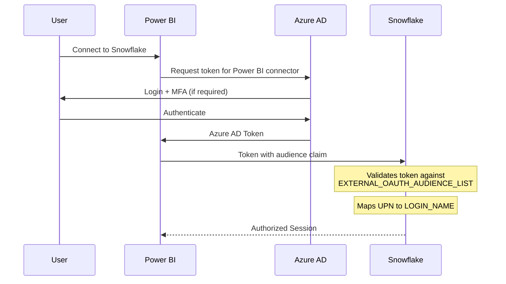
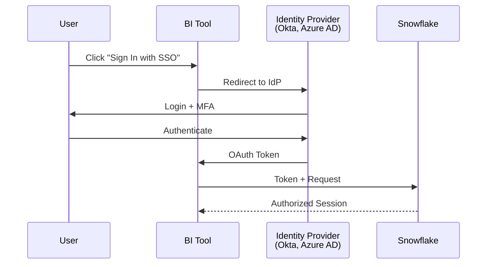

# OAuth / Service Principal Authentication

<span class="security-badge security-best-practice">Best Practice</span>

OAuth provides enterprise-grade authentication by integrating Snowflake with your organization's identity provider (IdP). This is the **recommended method** for both interactive users and service accounts in production environments.

!!! success "Proven Configuration"
    The Power BI External OAuth configuration in this guide has been tested and verified to work with Azure AD and Snowflake.

## Overview

### Power BI External OAuth Flow



### Generic OAuth/SSO Flow



---

## Pros and Cons

<div class="pros-cons-grid" markdown>
<div class="pros-box" markdown>
#### :material-check-circle: Advantages

- **Enterprise Security** — Leverages existing IdP infrastructure and security policies
- **MFA Support** — Native MFA through identity provider (Okta, Azure AD, etc.)
- **Centralized Management** — Single point for user provisioning and deprovisioning
- **Audit Trail** — Complete logging via IdP and Snowflake audit logs
- **Token-Based** — No password stored in BI tool connections
- **SSO Experience** — Single login across applications (no password fatigue)
- **Compliance Ready** — Meets enterprise security standards (SOC 2, HIPAA, etc.)
- **Conditional Access** — Enforce location, device trust, and risk-based policies
- **Automatic User Sync** — Users automatically provisioned/deprovisioned
- **Password Policy Enforcement** — IdP enforces password complexity and rotation
- **Multi-IdP Support** — Can integrate with multiple identity providers
- **Row-Level Security** — User identity flows to Snowflake for RLS policies
- **Reduced Support Burden** — Users use existing corporate credentials
</div>
<div class="cons-box" markdown>
#### :material-close-circle: Disadvantages

- **Initial Complexity** — Requires IdP and Snowflake configuration coordination
- **IT Dependency** — Needs coordination with identity/security team
- **Token Expiration** — Users must re-authenticate periodically (default 90 days)
- **IdP Dependency** — IdP outage affects all Snowflake access
- **Setup Time** — Longer initial configuration (days to weeks)
- **Not for Automation** — Requires interactive login (use Key-Pair for automation)
- **User Mapping Complexity** — Must ensure user identifiers match between systems
- **Token Management** — Need to handle token refresh and expiration gracefully
- **Limited Excel Support** — Excel ODBC does not support OAuth natively
- **Configuration Maintenance** — Requires ongoing coordination for changes
- **Potential Performance** — Additional authentication hop may add slight latency
- **Cost** — May require IdP licensing (though many orgs already have this)
</div>
</div>

---

## Supported Identity Providers

| Identity Provider | Tableau | Power BI | Snowflake Support |
|-------------------|:-------:|:--------:|:-----------------:|
| **Okta** | :white_check_mark: | :white_check_mark: | :white_check_mark: Native |
| **Azure AD / Entra ID** | :white_check_mark: | :white_check_mark: | :white_check_mark: Native |
| **OneLogin** | :white_check_mark: | :warning: | :white_check_mark: Native |
| **Ping Identity** | :white_check_mark: | :warning: | :white_check_mark: Native |
| **Google Workspace** | :white_check_mark: | :warning: | :white_check_mark: Via SAML |
| **Custom SAML** | :white_check_mark: | :warning: | :white_check_mark: Configurable |

---

## Configuration Overview

### Prerequisites

Before configuring OAuth/SSO, ensure:

- [x] IdP administrator access
- [x] Snowflake ACCOUNTADMIN or SECURITYADMIN role
- [x] Users provisioned in both IdP and Snowflake
- [x] Matching email addresses between IdP and Snowflake

### Snowflake Configuration

=== "OAuth with Azure AD (Entra ID)"

    **Step 1: Create OAuth Security Integration**
    
    ```sql
    CREATE OR REPLACE SECURITY INTEGRATION azure_oauth
        TYPE = EXTERNAL_OAUTH
        ENABLED = TRUE
        EXTERNAL_OAUTH_TYPE = AZURE
        EXTERNAL_OAUTH_ISSUER = 'https://sts.windows.net/<tenant-id>/'
        EXTERNAL_OAUTH_JWS_KEYS_URL = 'https://login.microsoftonline.com/<tenant-id>/discovery/v2.0/keys'
        EXTERNAL_OAUTH_AUDIENCE_LIST = ('https://<account>.snowflakecomputing.com')
        EXTERNAL_OAUTH_TOKEN_USER_MAPPING_CLAIM = 'upn'
        EXTERNAL_OAUTH_SNOWFLAKE_USER_MAPPING_ATTRIBUTE = 'login_name'
        EXTERNAL_OAUTH_ANY_ROLE_MODE = 'ENABLE';
    ```
    
    **Step 2: Register Application in Azure**
    
    1. Go to **Azure Portal** → **Azure Active Directory** → **App registrations**
    2. Click **New registration**
    3. Configure:
        - Name: `Snowflake BI Connection`
        - Supported account types: Single tenant
        - Redirect URI: Based on your BI tool
    4. Note the **Application (client) ID** and **Tenant ID**
    5. Create a **Client Secret** under Certificates & secrets

=== "OAuth with Okta"

    **Step 1: Create OAuth Security Integration**
    
    ```sql
    CREATE OR REPLACE SECURITY INTEGRATION okta_oauth
        TYPE = EXTERNAL_OAUTH
        ENABLED = TRUE
        EXTERNAL_OAUTH_TYPE = OKTA
        EXTERNAL_OAUTH_ISSUER = 'https://<your-org>.okta.com/oauth2/<auth-server-id>'
        EXTERNAL_OAUTH_JWS_KEYS_URL = 'https://<your-org>.okta.com/oauth2/<auth-server-id>/v2/keys'
        EXTERNAL_OAUTH_TOKEN_USER_MAPPING_CLAIM = 'sub'
        EXTERNAL_OAUTH_SNOWFLAKE_USER_MAPPING_ATTRIBUTE = 'login_name'
        EXTERNAL_OAUTH_ANY_ROLE_MODE = 'ENABLE';
    ```
    
    **Step 2: Configure Okta Application**
    
    1. Go to **Okta Admin Console** → **Applications**
    2. Click **Create App Integration**
    3. Select **OIDC - OpenID Connect**
    4. Choose **Web Application**
    5. Configure:
        - App name: `Snowflake BI Tools`
        - Sign-in redirect URIs: Based on your BI tool
        - Sign-out redirect URIs: Your app's logout URL
    6. Assign users/groups to the application

=== "Power BI External OAuth (Recommended)"

    This configuration enables seamless SSO between Power BI and Snowflake using Azure AD tokens.
    
    **Step 1: Create External OAuth Security Integration**
    
    ```sql
    CREATE OR REPLACE SECURITY INTEGRATION powerbi_external_oauth
      TYPE = EXTERNAL_OAUTH
      ENABLED = TRUE
      EXTERNAL_OAUTH_TYPE = AZURE
      EXTERNAL_OAUTH_ISSUER = 'https://sts.windows.net/<Azure_Tenant_ID>/'
      EXTERNAL_OAUTH_JWS_KEYS_URL = 'https://login.microsoftonline.com/common/discovery/keys'
      EXTERNAL_OAUTH_AUDIENCE_LIST = (
        'https://analysis.windows.net/powerbi/connector/Snowflake',
        'https://analysis.windows.net/powerbi/connector/snowflake'
      )
      EXTERNAL_OAUTH_TOKEN_USER_MAPPING_CLAIM = 'upn'
      EXTERNAL_OAUTH_SNOWFLAKE_USER_MAPPING_ATTRIBUTE = 'LOGIN_NAME';
    ```
    
    !!! info "Replace `<Azure_Tenant_ID>`"
        Find your tenant ID in **Azure Portal** → **Azure Active Directory** → **Overview** → **Tenant ID**
    
    **Step 2: Configure Allowed Roles**
    
    ```sql
    ALTER SECURITY INTEGRATION powerbi_external_oauth
      SET EXTERNAL_OAUTH_ALLOWED_ROLES_LIST = (
        'PUBLIC',
        'ANALYTICS_ROLE'  -- Add your BI roles here
      );
    ```
    
    **Step 3: Ensure User Mapping**
    
    Snowflake users must have their `LOGIN_NAME` set to match their Azure AD UPN (email):
    
    ```sql
    -- Check existing users
    SELECT login_name, email FROM SNOWFLAKE.ACCOUNT_USAGE.USERS;
    
    -- Update user if needed
    ALTER USER john_doe SET LOGIN_NAME = 'john.doe@company.com';
    ```
    
    **Step 4: Connect from Power BI**
    
    1. Open **Power BI Desktop** or **Power BI Service**
    2. **Get Data** → **Snowflake**
    3. Enter your Snowflake account URL and warehouse
    4. Select **Microsoft Account** authentication
    5. Sign in with your Azure AD credentials
    6. Power BI automatically exchanges tokens with Snowflake

=== "Native Snowflake OAuth"

    For Tableau's built-in OAuth:
    
    ```sql
    CREATE OR REPLACE SECURITY INTEGRATION tableau_oauth
        TYPE = OAUTH
        ENABLED = TRUE
        OAUTH_CLIENT = TABLEAU_DESKTOP
        OAUTH_REFRESH_TOKEN_VALIDITY = 7776000; -- 90 days
    ```

---

## BI Tool Configuration

=== "Tableau"

    ### Tableau Desktop with OAuth
    
    1. Open **Tableau Desktop**
    2. Connect to **Snowflake**
    3. Select **Sign in using OAuth**
    4. Click **Sign In**
    5. Browser opens to your IdP login page
    6. Complete authentication (including MFA if enabled)
    7. Return to Tableau - connection established
    
    !!! tip "Token Refresh"
        Tableau caches OAuth tokens. Default expiration is 90 days.
        After expiration, you'll be prompted to re-authenticate.
    
    ### Tableau Server Configuration
    
    For published dashboards with OAuth:
    
    1. **Tableau Server Admin** → **Settings** → **Authentication**
    2. Enable **External OAuth** for Snowflake
    3. Configure saved credentials or prompt users
    
    ```yaml
    # Example tableau server config
    wgserver.authentication.oauth.enabled: true
    wgserver.authentication.oauth.snowflake.enabled: true
    ```

=== "Power BI"

    ### Power BI Service with Azure AD SSO
    
    **Prerequisites:**
    
    - Azure AD tenant with Power BI
    - Snowflake configured for Azure AD OAuth
    - Matching user emails in both systems
    
    **Configuration:**
    
    1. **Power BI Admin Portal** → **Tenant settings**
    2. Enable **Snowflake SSO**
    3. In Snowflake:
    
    ```sql
    -- Verify Azure AD integration
    DESCRIBE SECURITY INTEGRATION azure_oauth;
    
    -- Ensure users have matching identifiers
    SELECT login_name, email FROM SNOWFLAKE.ACCOUNT_USAGE.USERS
    WHERE email IS NOT NULL;
    ```
    
    **User Connection:**
    
    1. In Power BI Service, create/open a report
    2. Connect to Snowflake data source
    3. Select **OAuth2** authentication
    4. User is authenticated via Azure AD automatically
    
    ### Power BI Desktop
    
    1. **Get Data** → **Snowflake**
    2. Enter server and warehouse
    3. Under **Advanced options**, select **AAD Interactive**
    4. Sign in with organizational account
    
    !!! warning "DirectQuery Requirements"
        For SSO with DirectQuery:
        
        - Azure AD accounts must match Snowflake users
        - Power BI Premium capacity required for some features

=== "Excel"

    !!! warning "Limited OAuth Support"
        Excel does not natively support OAuth for Snowflake ODBC connections.
        
        **Alternatives:**
        
        1. Use username/password with ODBC
        2. Use Key-Pair authentication via ODBC
        3. Connect via Power Query which supports OAuth

---

## Token Management

### Token Lifecycle

```
┌─────────────────────────────────────────────────────────────────┐
│                        OAuth Token Flow                          │
├─────────────────────────────────────────────────────────────────┤
│                                                                   │
│  Initial Login ──▶ Access Token ──▶ Expires ──▶ Refresh Token    │
│       │              (Short)         │            (Long)          │
│       │                              │              │              │
│       ▼                              ▼              ▼              │
│  IdP Auth + MFA               Re-authenticate   Seamless Refresh  │
│                                                                   │
└─────────────────────────────────────────────────────────────────┘
```

### Configure Token Validity

```sql
-- View current settings
DESCRIBE SECURITY INTEGRATION tableau_oauth;

-- Modify token validity (max 90 days)
ALTER SECURITY INTEGRATION tableau_oauth
    SET OAUTH_REFRESH_TOKEN_VALIDITY = 7776000; -- seconds

-- For shorter sessions (7 days)
ALTER SECURITY INTEGRATION tableau_oauth
    SET OAUTH_REFRESH_TOKEN_VALIDITY = 604800;
```

---

## Troubleshooting

??? question "Error: OAuth token is invalid or expired"
    **Solutions:**
    
    1. Clear cached credentials in the BI tool
    2. Re-authenticate via OAuth flow
    3. Verify token validity settings in Snowflake
    4. Check IdP session policies

??? question "Error: User not found in Snowflake"
    **Solutions:**
    
    1. Verify user exists in Snowflake with matching identifier:
    ```sql
    SELECT * FROM SNOWFLAKE.ACCOUNT_USAGE.USERS 
    WHERE login_name = 'user@company.com';
    ```
    2. Check user mapping claim configuration
    3. Ensure email/UPN matches between IdP and Snowflake

??? question "Error: SAML assertion failed"
    **Solutions:**
    
    1. Verify SAML certificate hasn't expired
    2. Check clock synchronization between IdP and Snowflake
    3. Validate SAML attribute mappings
    4. Review IdP logs for details

??? question "MFA not prompting"
    **Solutions:**
    
    1. Check IdP conditional access policies
    2. Verify MFA is enabled for the application
    3. Clear browser cache and cookies
    4. Try incognito/private browsing

---

## Security Best Practices

!!! success "Recommended Configuration"
    
    1. **Enforce MFA** at the IdP level
    2. **Set reasonable token expiry** (7-30 days for interactive)
    3. **Implement conditional access** (location, device trust)
    4. **Regular access reviews** via IdP
    5. **Monitor OAuth usage** in Snowflake:
    
    ```sql
    SELECT * FROM SNOWFLAKE.ACCOUNT_USAGE.LOGIN_HISTORY
    WHERE AUTHENTICATION_METHOD = 'OAUTH_ACCESS_TOKEN'
    ORDER BY EVENT_TIMESTAMP DESC
    LIMIT 100;
    ```

---

## Next Steps

- **[Key-Pair Authentication](key-pair.md)** — For service accounts and automation
- **[Best Practices: Security](../best-practices/security.md)** — Complete security guide

