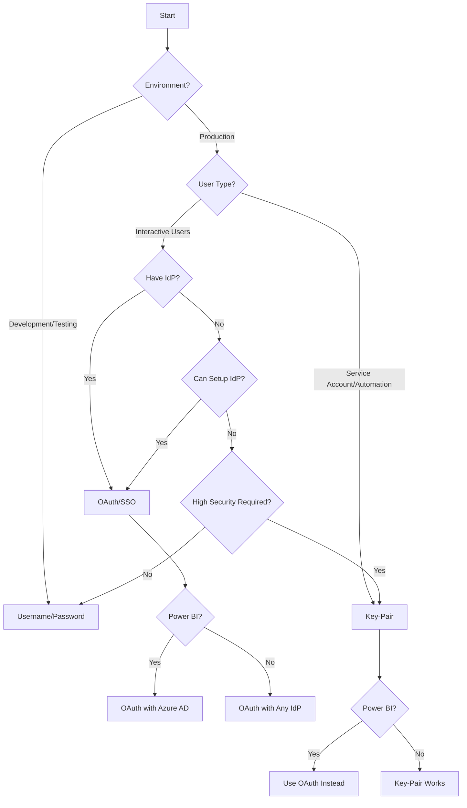

# Authentication Quick Reference

<div class="hero-section" markdown>
## :material-compass: Choose Your Authentication Method

Quick decision guide for selecting the right authentication method
</div>

## Decision Tree



---

## Quick Comparison Table

| Factor | Username/Password | OAuth/SSO | Key-Pair |
|--------|:-----------------:|:--------:|:--------:|
| **Setup Time** | Minutes | Days/Weeks | Hours |
| **Security Level** | ⭐⭐ | ⭐⭐⭐⭐⭐ | ⭐⭐⭐⭐⭐ |
| **MFA Support** | ⚠️ Limited | ✅ Full | N/A |
| **Automation** | ⚠️ MFA Issues | ⚠️ Token Expiry | ✅ Perfect |
| **Tool Support** | ✅ All | ⚠️ Most | ⚠️ Limited |
| **Maintenance** | Low | Medium | Medium |
| **Best For** | Dev/Testing | Enterprise Users | Service Accounts |

---

## Use Case Matrix

### By Environment

| Environment | Recommended Method | Alternative |
|-------------|-------------------|-------------|
| **Development** | Username/Password | Key-Pair |
| **Staging** | OAuth/SSO | Key-Pair |
| **Production - Users** | OAuth/SSO | - |
| **Production - Automation** | Key-Pair | - |

### By User Type

| User Type | Recommended Method | Why |
|-----------|-------------------|-----|
| **Business Analyst** | OAuth/SSO | SSO experience, MFA |
| **Data Scientist** | OAuth/SSO | Access to multiple tools |
| **Developer** | Key-Pair or OAuth/SSO | Depends on use case |
| **Service Account** | Key-Pair | No password, automation |
| **ETL Process** | Key-Pair | Scheduled jobs, no MFA |

### By BI Tool

| Tool | Best Method | Alternatives |
|------|-----------|-------------|
| **Tableau Desktop** | OAuth/SSO | Key-Pair, Username/Password |
| **Tableau Server** | OAuth/SSO | Key-Pair (for extracts) |
| **Power BI Desktop** | OAuth/SSO | Username/Password |
| **Power BI Service** | OAuth/SSO | Username/Password |
| **Excel** | Key-Pair | Username/Password |

---

## Platform Considerations

### Windows

| Method | Support | Notes |
|--------|:-------:|-------|
| Username/Password | ✅ Full | Works everywhere |
| OAuth/SSO | ✅ Full | Azure AD native for Power BI |
| Key-Pair | ✅ Full | OpenSSL required |

### macOS

| Method | Support | Notes |
|--------|:-------:|-------|
| Username/Password | ✅ Full | Works everywhere |
| OAuth/SSO | ✅ Full | Tableau full support |
| Key-Pair | ✅ Full | Native OpenSSL support |

---

## Security Requirements

### Low Security (Development)

- ✅ Username/Password acceptable
- ✅ No MFA required
- ✅ Simple setup priority

### Medium Security (Staging)

- ⚠️ OAuth/SSO recommended
- ⚠️ MFA optional
- ⚠️ Network policies considered

### High Security (Production)

- ✅ OAuth/SSO required for users
- ✅ Key-Pair for automation
- ✅ MFA mandatory
- ✅ Network policies enforced
- ✅ Audit logging enabled

### Compliance Requirements

| Compliance | Required Method | Additional Requirements |
|------------|----------------|------------------------|
| **SOC 2** | OAuth/SSO or Key-Pair | Audit logs, access reviews |
| **HIPAA** | OAuth/SSO with MFA | Encryption, audit trail |
| **GDPR** | OAuth/SSO | Access controls, audit logs |
| **PCI DSS** | OAuth/SSO + Key-Pair | Network policies, encryption |

---

## Migration Path

### From Username/Password to OAuth/SSO

```
Week 1: Configure IdP and Snowflake OAuth
Week 2: Test with pilot users
Week 3: Roll out to all users
Week 4: Disable password auth (optional)
```

### From Username/Password to Key-Pair

```
Day 1: Generate key pairs
Day 2: Register public keys in Snowflake
Day 3: Update BI tool connections
Day 4: Test and verify
Day 5: Disable password auth
```

---

## Common Scenarios

### Scenario 1: Small Team, Quick Start

**Situation:** 5 analysts need immediate access

**Recommendation:** 
- Start with Username/Password
- Plan migration to OAuth/SSO within 3 months

### Scenario 2: Enterprise with Existing IdP

**Situation:** 200+ users, Okta already in place

**Recommendation:**
- OAuth/SSO immediately
- Key-Pair for service accounts

### Scenario 3: Automated Reporting

**Situation:** Tableau Server scheduled extracts

**Recommendation:**
- Key-Pair authentication
- Service account with minimal permissions

### Scenario 4: Power BI Only

**Situation:** Organization uses only Power BI

**Recommendation:**
- OAuth/SSO with Azure AD
- No Key-Pair (not supported)

### Scenario 5: Mixed Environment

**Situation:** Tableau, Power BI, and Excel users

**Recommendation:**
- OAuth/SSO for Tableau and Power BI
- Key-Pair for Excel service accounts
- Username/Password for Excel ad-hoc users

---

## Troubleshooting Quick Guide

| Issue | Username/Password | OAuth/SSO | Key-Pair |
|-------|:----------------:|:---------:|:--------:|
| **Can't connect** | Check credentials | Check IdP | Check key path |
| **MFA blocking** | Disable MFA or use OAuth | Normal flow | N/A |
| **Token expired** | N/A | Re-authenticate | N/A |
| **Scheduled refresh fails** | MFA issue | Token expiry | Check key permissions |
| **Power BI not working** | Works | Works | Not supported |

---

## Cost Considerations

| Method | Setup Cost | Ongoing Cost | Notes |
|--------|-----------|--------------|-------|
| **Username/Password** | $0 | $0 | No additional tools |
| **OAuth/SSO** | IT time | IdP licensing | Most orgs already have IdP |
| **Key-Pair** | Development time | Maintenance | OpenSSL free, key management tools optional |

---

## Next Steps

Based on your selection:

- **[Username/Password Setup](username-password.md)** — Quick configuration
- **[OAuth/SSO Setup](oauth-sso.md)** — Enterprise authentication
- **[Key-Pair Setup](key-pair.md)** — Service account authentication

---

## Still Unsure?

Answer these questions:

1. **Do you have an identity provider (Okta, Azure AD, etc.)?**
   - Yes → OAuth/SSO
   - No → Continue

2. **Is this for automated processes or scheduled jobs?**
   - Yes → Key-Pair
   - No → Continue

3. **Do you need MFA and centralized user management?**
   - Yes → Set up OAuth/SSO
   - No → Username/Password acceptable for small teams

4. **Are you using Power BI?**
   - Yes → OAuth/SSO (Key-Pair not supported)
   - No → Any method works

---

## Quick Links

- **[Authentication Overview](overview.md)** — Detailed comparison
- **[Security Best Practices](../best-practices/security.md)** — Security recommendations
- **[Platform Guides](../platforms/windows.md)** — Windows and macOS specific

