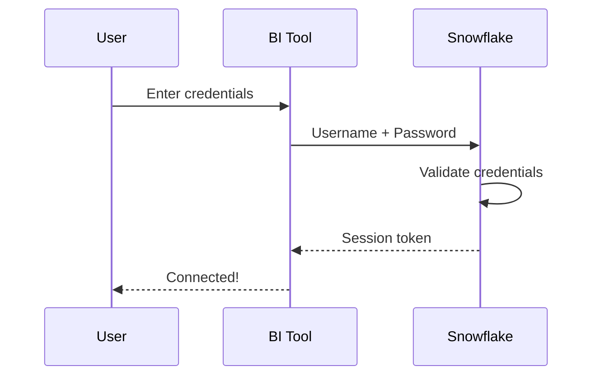

# Username & Password Authentication

<span class="security-badge security-low">Basic Security</span>

!!! danger "Not for Production - MFA Required"
    **Snowflake is requiring MFA (Multi-Factor Authentication) for all accounts.** Username and password authentication is **not suitable for production environments** because:
    
    - MFA will be required, which breaks automated connections and scheduled refreshes
    - Credentials stored in connection files pose security risks
    - No centralized identity management
    - Does not meet enterprise security standards
    
    **Use OAuth/SSO, Key-Pair, or Programmatic Access Tokens for production environments.**

Username and password is the simplest authentication method for connecting BI tools to Snowflake. **This method should only be used for test/development accounts**, not production environments.

## Overview



---

## Pros and Cons

<div class="pros-cons-grid" markdown>
<div class="pros-box" markdown>
#### :material-check-circle: Advantages

- **Simple Setup** — No additional configuration required
- **Universal Support** — Works with all BI tools (Tableau, Power BI, Excel)
- **Quick Start** — Connect in minutes, no IT coordination needed
- **Familiar** — Standard authentication flow users understand
- **No Dependencies** — No IdP, OAuth provider, or key management needed
- **Works Everywhere** — Supported on Windows and macOS
- **No Token Expiration** — Credentials persist until changed
- **Immediate Access** — No waiting for IdP configuration
- **Development Friendly** — Ideal for local development and testing
</div>
<div class="cons-box" markdown>
#### :material-close-circle: Disadvantages

- **Security Risk** — Credentials stored in connection files/workbooks
- **MFA Complications** — Interactive MFA may block automated connections
- **No Centralized Control** — Users manage own passwords independently
- **Password Fatigue** — Another credential to remember and rotate
- **Audit Limitations** — Harder to track and audit access patterns
- **Compliance Issues** — May not meet enterprise security requirements
- **Scheduled Refresh Problems** — MFA-enabled accounts break automated refreshes
- **Credential Theft Risk** — Passwords can be compromised or shared
- **No SSO Integration** — Cannot leverage existing corporate identity
- **Manual Rotation** — Password changes require manual updates in all connections
- **No Conditional Access** — Cannot enforce location/device policies
</div>
</div>

---

## When to Use

| Scenario | Recommendation | Rationale |
|----------|----------------|-----------|
| Development/Testing | :white_check_mark: Acceptable | Quick setup, no security concerns in dev |
| Personal Analytics | :white_check_mark: Acceptable | Individual use, low risk |
| Production - Single User | :warning: Consider OAuth | Security concerns, but manageable for one user |
| Production - Team | :x: Use OAuth/SSO | Centralized management required |
| Automated Pipelines | :x: Use Key-Pair | MFA breaks automation, key-pair is designed for this |
| Compliance Required | :x: Use OAuth/SSO | Audit trails and centralized control needed |
| Service Accounts | :x: Use Key-Pair | No password management, stronger security |
| Scheduled Refreshes | :x: Use Key-Pair or OAuth | MFA breaks scheduled jobs |
| Enterprise Environment | :x: Use OAuth/SSO | Integration with existing IdP infrastructure |
| High Security Data | :x: Use OAuth/SSO or Key-Pair | Enhanced security required |

---

## Setup Instructions

=== "Tableau"

    ### Tableau Desktop Connection
    
    1. Open **Tableau Desktop**
    2. Click **Connect** → **To a Server** → **Snowflake**
    3. Enter your connection details:
    
    | Field | Value |
    |-------|-------|
    | Server | `your-account.snowflakecomputing.com` |
    | Role | Your Snowflake role (optional) |
    | Authentication | **Username and Password** |
    | Username | Your Snowflake username |
    | Password | Your Snowflake password |
    
    4. Click **Sign In**
    5. Select your **Warehouse**, **Database**, and **Schema**
    
    
    
    !!! tip "Save Password"
        Check "Remember Password" for convenience, but be aware this stores credentials locally.

=== "Power BI"

    ### Power BI Desktop Connection
    
    1. Open **Power BI Desktop**
    2. Click **Get Data** → **Database** → **Snowflake**
    3. Enter connection details:
    
    | Field | Value |
    |-------|-------|
    | Server | `your-account.snowflakecomputing.com` |
    | Warehouse | Your warehouse name |
    | Database | Your database (optional) |
    
    4. Choose **Data Connectivity mode**:
        - **Import** — Loads data into Power BI
        - **DirectQuery** — Queries Snowflake live
    
    5. Click **OK**
    6. Select **Database** authentication
    7. Enter **Username** and **Password**
    8. Click **Connect**
    
    !!! warning "MFA Consideration"
        If MFA is enabled on your account, you may encounter issues with scheduled refresh. Consider OAuth for production.

=== "Excel"

    ### Excel ODBC Connection (Windows)
    
    **Step 1: Configure ODBC Data Source**
    
    1. Open **ODBC Data Source Administrator** (64-bit)
    2. Go to **User DSN** or **System DSN** tab
    3. Click **Add**
    4. Select **SnowflakeDSIIDriver** → **Finish**
    5. Configure the data source:
    
    | Field | Value |
    |-------|-------|
    | Data Source | `Snowflake_DSN` (your choice) |
    | Server | `your-account.snowflakecomputing.com` |
    | Database | Your database |
    | Schema | Your schema |
    | Warehouse | Your warehouse |
    | Role | Your role (optional) |
    | Authenticator | Leave blank for password auth |
    
    6. Click **OK**
    
    **Step 2: Connect from Excel**
    
    1. Open **Excel**
    2. Go to **Data** → **Get Data** → **From Other Sources** → **From ODBC**
    3. Select your DSN → **OK**
    4. Enter **Username** and **Password**
    5. Select tables/views and click **Load**
    
    ### Excel on macOS
    
    1. Configure ODBC via `~/.odbc.ini`:
    
    ```ini
    [Snowflake]
    Driver = /opt/snowflake/snowflakeodbc/lib/libSnowflake.dylib
    Server = your-account.snowflakecomputing.com
    Database = YOUR_DATABASE
    Schema = YOUR_SCHEMA
    Warehouse = YOUR_WAREHOUSE
    ```
    
    2. Use Excel's ODBC connection with the configured DSN

---

## Security Hardening

If you must use username/password authentication, follow these guidelines:

### Password Requirements

- [x] Minimum 14 characters
- [x] Mix of uppercase, lowercase, numbers, symbols
- [x] Unique password (not used elsewhere)
- [x] Change every 90 days

### Account Settings

Configure in Snowflake to enhance security:

```sql
-- Enforce password policy
ALTER ACCOUNT SET PASSWORD_HISTORY = 5;
ALTER ACCOUNT SET PASSWORD_MIN_LENGTH = 14;
ALTER ACCOUNT SET PASSWORD_MAX_AGE_DAYS = 90;

-- Lock after failed attempts
ALTER ACCOUNT SET PASSWORD_LOCK_AFTER_NUM_TRIES = 5;
ALTER ACCOUNT SET PASSWORD_UNLOCK_AFTER_MIN = 30;
```

### Network Policies

Restrict access by IP:

```sql
-- Create network policy
CREATE NETWORK POLICY office_only
  ALLOWED_IP_LIST = ('203.0.113.0/24', '198.51.100.0/24');

-- Apply to user
ALTER USER john_doe SET NETWORK_POLICY = office_only;
```

---

## MFA Considerations

!!! warning "MFA and BI Tool Connections"
    Multi-Factor Authentication (MFA) can cause issues with BI tool connections:
    
    - **Interactive Sessions**: MFA prompt may not display correctly
    - **Scheduled Refresh**: Will fail if MFA is required
    - **Background Connections**: Cannot complete MFA challenge

### Solutions

1. **MFA Exemption** (Not Recommended)
   ```sql
   ALTER USER service_user SET DISABLE_MFA = TRUE;
   ```

2. **Use OAuth Instead** — OAuth handles MFA through the IdP

3. **Use Key-Pair for Automation** — Bypasses MFA requirement

---

## Troubleshooting

??? question "Error: Invalid username or password"
    - Verify credentials in Snowflake web UI first
    - Check for account lockout
    - Ensure username is correct (case-sensitive)
    - Verify account identifier format

??? question "Error: Connection timed out"
    - Check network connectivity
    - Verify firewall allows outbound 443
    - Confirm Snowflake account URL is correct
    - Test with Snowflake web UI

??? question "MFA popup not appearing"
    - Some BI tools don't support interactive MFA
    - Consider using OAuth or disabling MFA for the user
    - Check if browser-based auth is an option

---

## Next Steps

For enhanced security, consider migrating to:

- **[OAuth / SSO](oauth-sso.md)** — For interactive users with enterprise IdP
- **[Key-Pair Authentication](key-pair.md)** — For service accounts and automation

