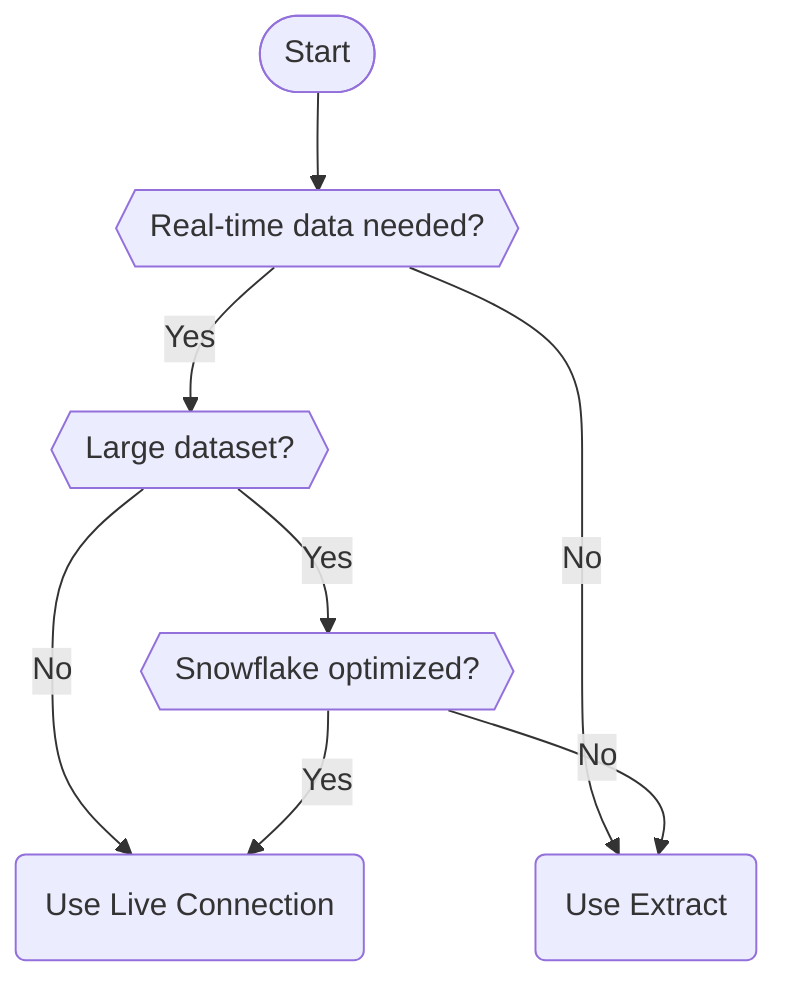

# Tableau Connection Guide

<div class="hero-section" markdown>
## :material-chart-areaspline: Connect Tableau to Snowflake

Complete guide for Tableau Desktop and Server on Windows and macOS
</div>

## Overview

Tableau provides native Snowflake integration with support for all major authentication methods. This guide covers setup for both Tableau Desktop and Tableau Server/Cloud.

### Supported Features

| Feature | Tableau Desktop | Tableau Server | Tableau Cloud |
|---------|:---------------:|:--------------:|:-------------:|
| Live Connection | :white_check_mark: | :white_check_mark: | :white_check_mark: |
| Extracts | :white_check_mark: | :white_check_mark: | :white_check_mark: |
| Username/Password | :white_check_mark: | :white_check_mark: | :white_check_mark: |
| OAuth | :white_check_mark: | :white_check_mark: | :white_check_mark: |
| Key-Pair Auth | :white_check_mark: | :white_check_mark: | :white_check_mark: |
| SAML SSO | :warning: Browser | :white_check_mark: | :white_check_mark: |

---

## Quick Start

### Step 1: Open Tableau and Connect

1. Launch **Tableau Desktop**
2. Under **Connect**, click **More...** → **Snowflake**

### Step 2: Enter Connection Details

| Field | Description | Example |
|-------|-------------|---------|
| **Server** | Your Snowflake account URL | `xy12345.us-east-1.snowflakecomputing.com` |
| **Role** | Snowflake role to use | `ANALYST_ROLE` (optional) |
| **Authentication** | Choose your method | See options below |

### Step 3: Select Data

1. Choose your **Warehouse**
2. Select **Database** and **Schema**
3. Drag tables to the canvas or write Custom SQL

---

## Authentication Methods

=== "Username & Password"

    ### Basic Authentication
    
    <span class="security-badge security-low">Basic Security</span>
    
    !!! danger "Not for Production - MFA Required"
        **Snowflake is requiring MFA (Multi-Factor Authentication) for all accounts.** Username and password authentication is **not suitable for production environments** because:
        
        - MFA will be required, which breaks automated connections and scheduled refreshes
        - Credentials stored in connection files pose security risks
        - No centralized identity management
        
        **Use OAuth/SSO or Key-Pair Authentication for production environments.**
    
    The simplest method - enter your Snowflake credentials directly. **Only use for test/development accounts.**
    
    **Configuration:**
    
    | Field | Value |
    |-------|-------|
    | Authentication | **Username and Password** |
    | Username | Your Snowflake username |
    | Password | Your Snowflake password |
    
    <div class="pros-cons-grid" markdown>
    <div class="pros-box" markdown>
    #### Pros
    - Quick setup
    - No additional configuration
    - Works immediately
    </div>
    <div class="cons-box" markdown>
    #### Cons
    - Less secure
    - MFA may interfere
    - Password stored locally
    </div>
    </div>
    
    !!! warning "MFA Consideration"
        If your Snowflake account has MFA enabled, you may be prompted each time you connect. Consider OAuth for smoother experience.

=== "OAuth"

    ### OAuth Authentication
    
    <span class="security-badge security-high">High Security</span>
    
    Authenticate through your identity provider with SSO support.
    
    **Configuration:**
    
    | Field | Value |
    |-------|-------|
    | Authentication | **Sign in using OAuth** |
    
    **Process:**
    
    1. Click **Sign In**
    2. Browser opens to your IdP login
    3. Complete authentication (including MFA)
    4. Return to Tableau - connected!
    
    <div class="pros-cons-grid" markdown>
    <div class="pros-box" markdown>
    #### Pros
    - Enterprise-grade security
    - MFA support
    - SSO experience
    - Token-based (no password stored)
    </div>
    <div class="cons-box" markdown>
    #### Cons
    - Requires Snowflake OAuth setup
    - Tokens expire (90 days default)
    - Initial IdP configuration needed
    </div>
    </div>
    
    **Prerequisites:**
    
    Snowflake must have OAuth configured:
    
    ```sql
    -- Check if Tableau OAuth is enabled
    SHOW SECURITY INTEGRATIONS LIKE '%TABLEAU%';
    
    -- Create if needed
    CREATE SECURITY INTEGRATION tableau_oauth
        TYPE = OAUTH
        ENABLED = TRUE
        OAUTH_CLIENT = TABLEAU_DESKTOP
        OAUTH_REFRESH_TOKEN_VALIDITY = 7776000;
    ```

=== "Key-Pair"

    ### Key-Pair Authentication
    
    <span class="security-badge security-high">Very High Security</span>
    
    Use RSA cryptographic keys for password-less authentication.
    
    **Configuration:**
    
    | Field | Value |
    |-------|-------|
    | Authentication | **Sign in using Private Key** |
    | Username | Your Snowflake username |
    | Private Key File | Path to your `.p8` file |
    | Private Key Password | Passphrase (if key is encrypted) |
    
    <div class="pros-cons-grid" markdown>
    <div class="pros-box" markdown>
    #### Pros
    - Strongest security
    - No password management
    - Ideal for automation
    - No MFA interruptions
    </div>
    <div class="cons-box" markdown>
    #### Cons
    - Complex initial setup
    - Key management required
    - Must protect private key
    </div>
    </div>
    
    **File Path Examples:**
    
    - macOS: `/Users/yourname/.snowflake/keys/rsa_key.p8`
    - Windows: `C:\Users\yourname\.snowflake\keys\rsa_key.p8`
    
    See [Key-Pair Authentication](../authentication/key-pair.md) for key generation.

---

## Platform-Specific Instructions

=== "Windows"

    ### Tableau on Windows
    
    **Installation:**
    
    1. Download Tableau Desktop from [tableau.com](https://www.tableau.com/products/desktop/download)
    2. Run installer and complete setup
    3. No additional drivers needed for Snowflake
    
    **ODBC Driver (Optional):**
    
    For custom SQL or specific configurations:
    
    1. Download [Snowflake ODBC Driver](https://developers.snowflake.com/odbc/)
    2. Install the 64-bit version
    3. Configure DSN if needed
    
    **File Paths:**
    
    - Private keys: `C:\Users\<username>\.snowflake\keys\`
    - Tableau logs: `C:\Users\<username>\Documents\My Tableau Repository\Logs\`

=== "macOS"

    ### Tableau on macOS
    
    **Installation:**
    
    1. Download Tableau Desktop from [tableau.com](https://www.tableau.com/products/desktop/download)
    2. Open `.dmg` and drag to Applications
    3. Snowflake connector is built-in
    
    **ODBC Driver (Optional):**
    
    ```bash
    # Download and install Snowflake ODBC driver
    # From: https://developers.snowflake.com/odbc/
    
    # Verify installation
    ls /opt/snowflake/snowflakeodbc/
    ```
    
    **File Paths:**
    
    - Private keys: `~/.snowflake/keys/`
    - Tableau logs: `~/Documents/My Tableau Repository/Logs/`
    
    **Permissions:**
    
    Ensure Tableau can access your private key:
    
    ```bash
    chmod 600 ~/.snowflake/keys/rsa_key.p8
    ```

---

## Connection Types

### Live Connection vs Extracts

| Aspect | Live Connection | Extract |
|--------|-----------------|---------|
| **Data Freshness** | Real-time | Scheduled refresh |
| **Performance** | Depends on Snowflake | Fast (local cache) |
| **Warehouse Usage** | Continuous | Only during refresh |
| **Offline Access** | No | Yes |
| **Best For** | Dashboards, real-time | Reports, large datasets |

### Choosing Connection Type



---

## Performance Optimization

### Snowflake Best Practices

```sql
-- Use clustering for frequently filtered columns
ALTER TABLE my_table CLUSTER BY (date_column);

-- Create result cache for common queries
ALTER SESSION SET USE_CACHED_RESULT = TRUE;

-- Right-size your warehouse
CREATE WAREHOUSE tableau_wh
    WAREHOUSE_SIZE = 'MEDIUM'
    AUTO_SUSPEND = 300
    AUTO_RESUME = TRUE;
```

### Tableau Best Practices

1. **Use Extracts for Large Datasets**
   - Schedule incremental refreshes
   - Filter data before extraction

2. **Optimize Custom SQL**
   - Avoid `SELECT *`
   - Push calculations to Snowflake
   - Use table calculations sparingly

3. **Initial SQL**
   ```sql
   -- Set warehouse for better performance
   ALTER SESSION SET WAREHOUSE = 'TABLEAU_WH';
   USE ROLE ANALYST_ROLE;
   ```

---

## Tableau Server Configuration

### Publishing with Saved Credentials

1. **Publish workbook** to Tableau Server
2. Under **Data Sources**, select your Snowflake connection
3. Choose authentication type:
   - **Embedded password** — Stored on server
   - **Prompt user** — Each user authenticates
   - **Viewer credentials** — Users' own credentials

### OAuth on Tableau Server

Configure Tableau Server for Snowflake OAuth:

1. **TSM Configuration:**
   ```bash
   tsm configuration set -k wgserver.oauth.snowflake.enabled -v true
   tsm pending-changes apply
   ```

2. **Saved Credential Policies:**
   - Enable saved credentials for Snowflake
   - Configure OAuth client ID/secret

### Key-Pair on Tableau Server

For service account connections:

1. Store private key on server
2. Configure via TSM or UI
3. Use for scheduled refreshes

---

## Troubleshooting

??? question "Error: Connection failed - cannot connect to Snowflake"
    **Solutions:**
    
    1. Verify account URL format: `account.region.snowflakecomputing.com`
    2. Check network connectivity (firewall, VPN)
    3. Test login via Snowflake web UI
    4. Verify warehouse is running

??? question "Error: OAuth token expired"
    **Solutions:**
    
    1. Clear saved credentials in Tableau
    2. Re-authenticate via OAuth
    3. Check token validity in Snowflake:
    ```sql
    DESC SECURITY INTEGRATION tableau_oauth;
    ```

??? question "Performance is slow"
    **Solutions:**
    
    1. Use Extracts for large datasets
    2. Scale up Snowflake warehouse
    3. Add clustering keys to tables
    4. Optimize your Tableau calculations
    5. Use Initial SQL to set context

??? question "Private key authentication fails"
    **Solutions:**
    
    1. Verify key file path is correct
    2. Check file permissions
    3. Confirm public key is registered in Snowflake
    4. Ensure key is in PKCS#8 format

---

## Quick Reference

### Connection String Format

```
Server: account.region.snowflakecomputing.com
Warehouse: YOUR_WAREHOUSE
Database: YOUR_DATABASE
Schema: YOUR_SCHEMA
Role: YOUR_ROLE (optional)
```

### Minimum Required Permissions

```sql
-- Grant access for Tableau user
GRANT USAGE ON WAREHOUSE tableau_wh TO ROLE tableau_role;
GRANT USAGE ON DATABASE analytics TO ROLE tableau_role;
GRANT USAGE ON SCHEMA analytics.public TO ROLE tableau_role;
GRANT SELECT ON ALL TABLES IN SCHEMA analytics.public TO ROLE tableau_role;
```

---

## Next Steps

- **[Power BI Guide](power-bi.md)** — Connect Power BI to Snowflake
- **[Best Practices](../best-practices/security.md)** — Security recommendations
- **[Troubleshooting](../troubleshooting.md)** — Common issues

