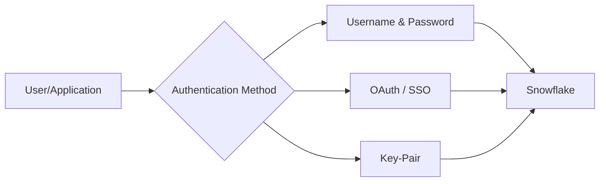

# Overview

This guide helps you connect Business Intelligence (BI) tools to Snowflake, covering authentication methods, platform-specific considerations, and best practices.

## What is Snowflake?

Snowflake is a cloud-based data warehouse that provides:

- **Separation of storage and compute** — Scale independently
- **Multi-cloud support** — AWS, Azure, and Google Cloud
- **Near-zero maintenance** — No infrastructure to manage
- **Secure data sharing** — Share data without copying

## Supported BI Tools

This documentation covers three major BI tools:

### :material-chart-areaspline: Tableau

Tableau is a powerful data visualization platform known for:

- Intuitive drag-and-drop interface
- Rich visualization library
- Strong community and resources
- Native Snowflake connector

### :material-chart-box: Power BI

Microsoft Power BI offers:

- Deep Microsoft ecosystem integration
- Cost-effective licensing
- Natural language queries (Q&A)
- DirectQuery and Import modes

### :material-table: Excel

Microsoft Excel provides:

- Familiar spreadsheet interface
- Pivot tables and charts
- Power Query for data transformation
- ODBC connectivity to Snowflake

## Authentication Methods Overview

Snowflake supports multiple authentication methods, each with different security levels and use cases:



### Method Comparison

| Aspect | Username/Password | OAuth/SSO | Key-Pair |
|--------|-------------------|-----------|----------|
| **Security** | Basic | High | Very High |
| **MFA Support** | Limited | Yes | N/A |
| **Setup Complexity** | Low | Medium | High |
| **Best For** | Testing | Enterprise | Automation |
| **Token Expiry** | N/A | Configurable | N/A |

## Connection Architecture

Understanding how BI tools connect to Snowflake helps troubleshoot issues:

```
┌─────────────────┐     ┌─────────────────┐     ┌─────────────────┐
│   BI Tool       │────▶│   Driver        │────▶│   Snowflake     │
│ (Tableau, etc.) │     │ (ODBC/JDBC)     │     │   Cloud         │
└─────────────────┘     └─────────────────┘     └─────────────────┘
         │                       │                       │
         │                       │                       │
    Authentication          Encryption              Data Storage
    Credentials             TLS 1.2+              Secure Compute
```

## Next Steps

1. **Check Prerequisites** — [Prerequisites](prerequisites.md)
2. **Choose Authentication** — [Authentication Overview](../authentication/overview.md)
3. **Connect Your Tool** — Select your BI tool guide

!!! info "Connection String Basics"
    Regardless of the method chosen, you'll need:
    
    - **Account Identifier** — Your Snowflake account (e.g., `xy12345.us-east-1`)
    - **Username** — Your Snowflake user
    - **Warehouse** — Compute resource for queries
    - **Database** — Default database (optional)
    - **Schema** — Default schema (optional)

